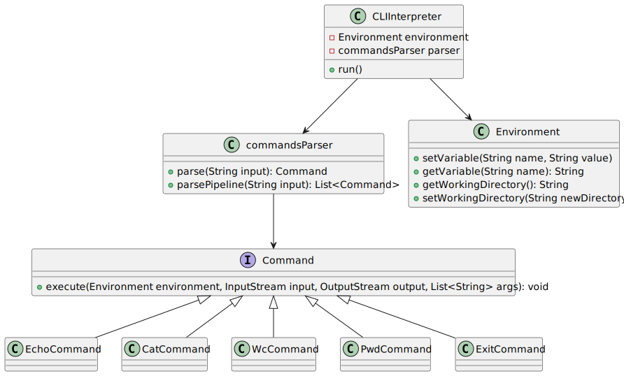

# Основные требования

- Поддержка команд `cat`, `echo`, `wc`, `pwd`, `exit`.
- Реализация оператора подстановки переменных окружения `$`.
- Поддержка пайплайнов и цитирования (одинарные и двойные кавычки).
- Возможность вызова внешних программ.

## Подводные камни:

- Управление окружением. Нужно предусмотреть хранение и подстановку переменных среды, следить за правильной
  интерпретацией кавычек и символов `$`.
- Обработка ошибок и поддержка внешних программ через процессы.
- Поддержка пайплайнов (комбинация нескольких команд через `|`), чтобы корректно передавать вывод одной команды в
  качестве ввода другой.

# Определение подсистем

Декомпозируем систему на несколько подсистем:

## Парсер командной строки

- Разбор пользовательского ввода, разделение аргументов, интерпретация кавычек, а также корректная
  работа с переменными окружения.
- Обработка пайплайнов и разделение команд.
- Методы:
    - `parse(String input): List<Command>`

## Команды

Команда — это элементарное действие, которое CLI-интерпретатор выполняет.

Она может быть встроенной (например, `echo`, `cat`, `pwd`) или внешней.

Команда возвращает один из типов результата:

* команда завершилась успешно;
* команда завершилась с ошибкой, в этом случае передаётся статус код;
* команда завершилась с требованием прерывать выполнение.

Результат выполнения последней команды сохраняется в окружении.

### Описание структуры команды

* Название: Имя команды, например, `echo` или `cat`.
* Аргументы: Список аргументов, передаваемых команде.
* Входные/выходные потоки: Потоки данных для команды.
* Метод исполнения: Метод `execute` команды выполняет её логику.

## Реестр команд

Реестр команд, который хранит все доступные команды.

- Методы:
    - `registerCommand(Command command)`
    - `getCommand(String name): Command` - возвращает найденную команду, либо команду запуска внешнего процесса.

## Окружение

- Класс для управления переменными окружения (например, `Environment`).
- Методы:
    - `setVariable(String name, String value)`
    - `getVariable(String name): String`
    - `getWorkingDirectory(): String`
    - `setWorkingDirectory(String newDirectory)`
- Системные переменные окружения
    - `PWD` - текущая рабочая директория
    - `?` - код выхода последней выполненной команды.
    - `$` - идентификатор процесса интерпретатора.

## Вызов внешних программ

- Возможность запускать команды операционной системы через процессы.
- Внешняя программа вызывается, если указанная команда не найдена в реестре команд.
- Статус выполнения внешней программы возвращается в виде кода выхода и сохраняется в окружении.
- Методы:
    - `runExternalCommand(parsedCommands: ParsedCommand, arguments: List<String>): Process`

## Логирование и обработка исключений

- Логирование для отладки и ведения журнала работы интерпретатора.
- Гибкая обработка ошибок для корректного сообщения о проблемах пользователю.

# Архитектурная диаграмма (приближение)

Диаграмма приведена в файле: [classes.puml](classes.puml)

  
Процесс интерпретации команды

# Словесное описание системы

CLI-интерпретатор работает следующим образом:

- Ввод пользователя обрабатывается через `commandsParser`, который разбирает строку, определяет команды, их аргументы и
  разбивает на пайплайны.
- Каждая команда представлена объектом, реализующим интерфейс `Command`, который вызывает метод `execute()`, передавая
  аргументы.
- Команды могут взаимодействовать с внешними программами через класс, ответственный за управление процессами.
- Система поддерживает окружение, переменные которого можно задавать и использовать в командах.
- Оператор пайплайна передает вывод одной команды на вход другой.

# Процесс парсинга

  
Схема

## Токенизация

Разделяем строку пользователя на отдельные токены, учитывая пробелы,
кавычки (одинарные и двойные), символы подстановки (`$`).

Учитываются кавычки:

* Одинарные кавычки `'` защищают строку целиком, без интерпретации символов `$` или пробелов.
* Двойные кавычки `"` позволяют подстановку переменных окружения, но сохраняют пробелы.

## Разбор подстановок переменных окружения

Во время токенизации обрабатываем символ `$`, если он присутствует, получаем имя переменной окружения.

Получаем имя и подставляем значение вместо подстановки.

Пример: токен `$FILE` заменяется на значение переменной `FILE`, хранящейся в окружении.

## Обработка пайплайнов

Если введенная строка содержит символ пайплайна (`|`), разделяем строку на несколько команд.
Каждая команда будет выполнена по очереди, при этом вывод одной команды передается на вход следующей.

## Создание объектов команд

После парсинга создается объект для каждой команды, который содержит название команды и список аргументов.
Если команда не известна, будет вызвана внешняя программа через процесс.

# Добавление новых команд

Чтобы добавить новую команду в систему, нужно выполнить несколько шагов:

## Создать новый класс команды

Реализовать новый класс, который будет имплементировать интерфейс Command.

## Зарегистрировать команду

Зарегистрировать команду в `commandsParser`, чтобы она могла быть распознана при парсинге.

## Добавить поддержку пайплайнов (если необходимо)

Убедиться, что команда поддерживает корректное чтение данных из входного потока и запись в выходной.

## Тестирование

Добавить юнит-тесты для новой команды, чтобы убедиться, что она работает корректно.